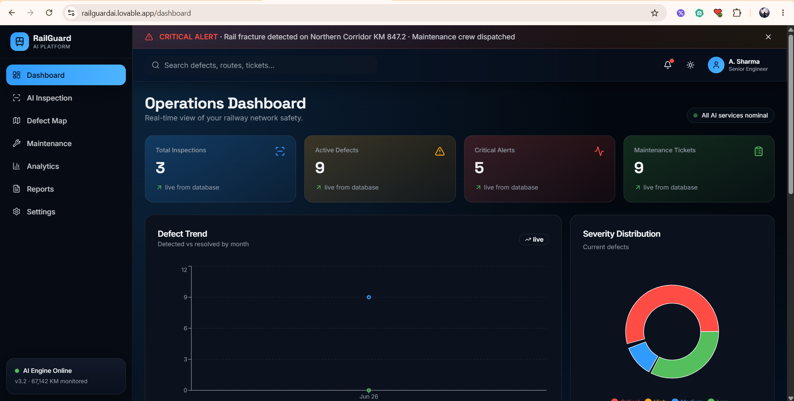
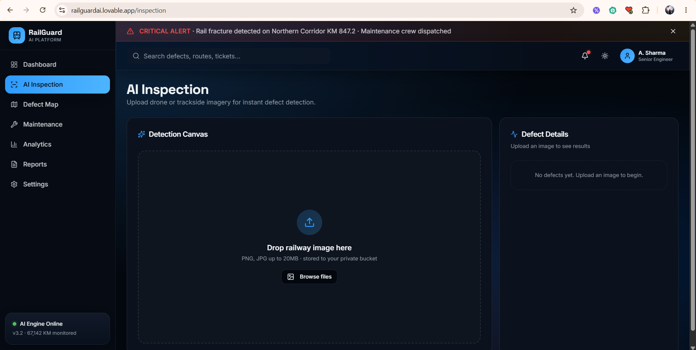
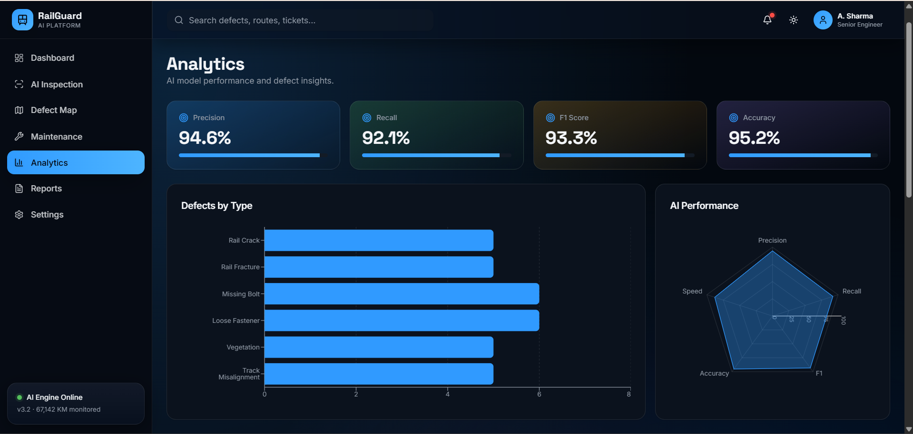
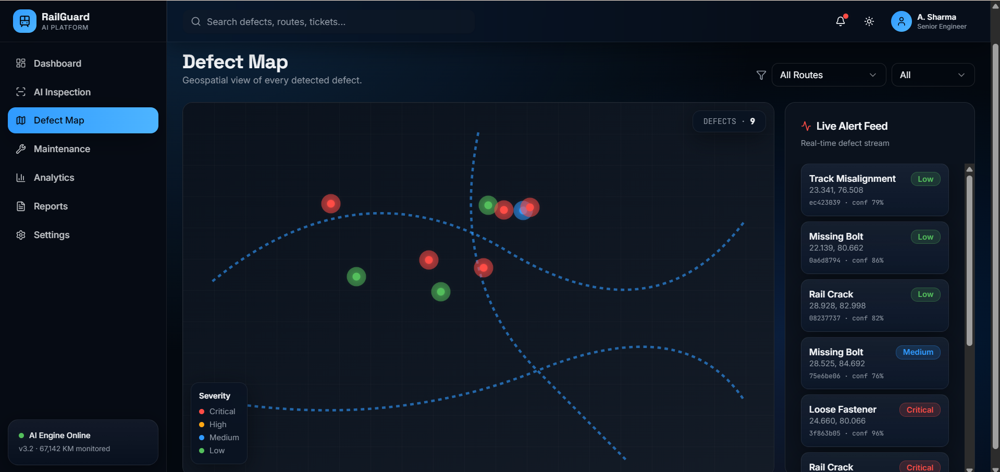
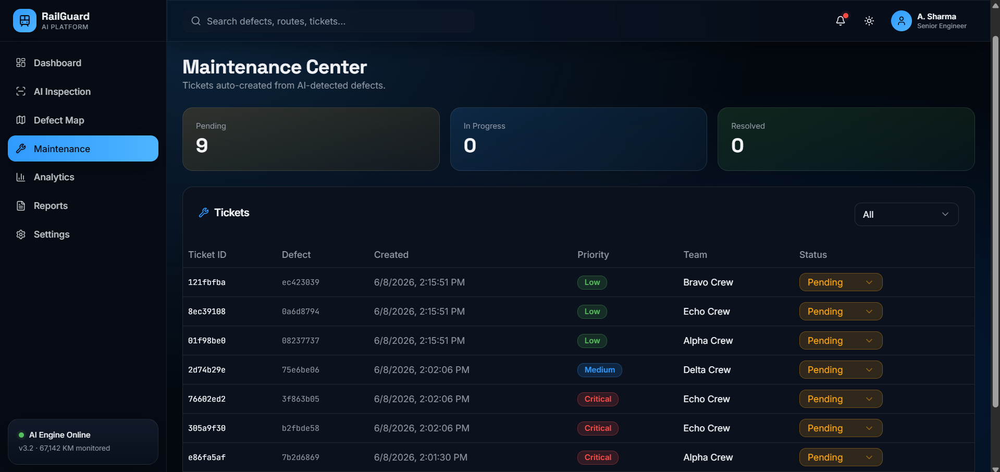
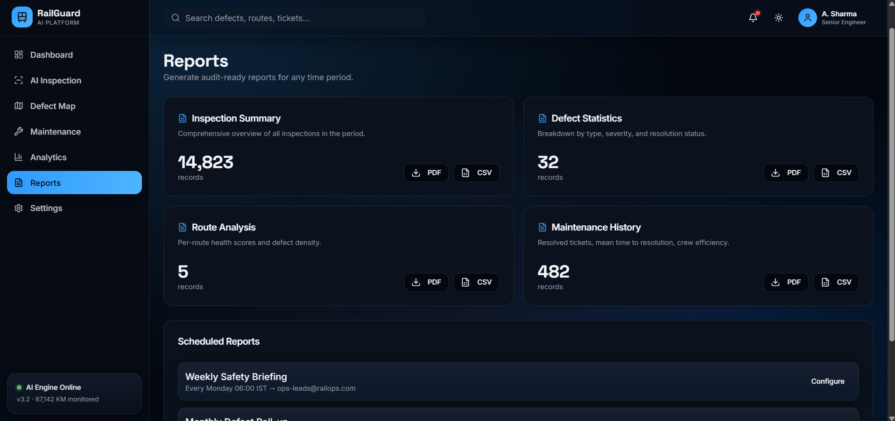

# RailGuardAI 🚆🛡️

AI-Powered Railway Safety Monitoring and Incident Detection System

## Overview

RailGuardAI is an intelligent railway safety platform that helps detect hazards, monitor incidents, and improve railway operational safety using Artificial Intelligence and Computer Vision.

## Features

* Real-time railway monitoring
* AI-powered hazard detection
* Gemini Vision integration
* Incident reporting dashboard
* Analytics and insights
* Modern responsive UI
* Cloud-based backend

## Tech Stack

### Frontend

* React
* TypeScript
* Vite
* Tailwind CSS

### Backend

* Supabase
* PostgreSQL

### AI/ML

* Google Gemini Vision API

## Project Structure

src/            Frontend source code

supabase/       Backend configuration and database

README.md       Project documentation

## Installation

```bash
# Install dependencies
npm install

# Set up environment variables
cp .env.example .env
# Edit .env with your Supabase credentials

# Start the dev server
npm run dev
```

## Future Scope

* Live CCTV integration
* Predictive maintenance
* Railway track anomaly detection
* Mobile application
* IOS support

## Screenshots

### Dashboard



### AI Detection



### Analytics



### Defect Map



### Maintenance Center



### Reports



## Contributing

We welcome contributions! Please read our [Contributing Guide](CONTRIBUTING.md) for details on setup, workflow, and conventions.

## Team

Hack Horizon

## License

MIT License
